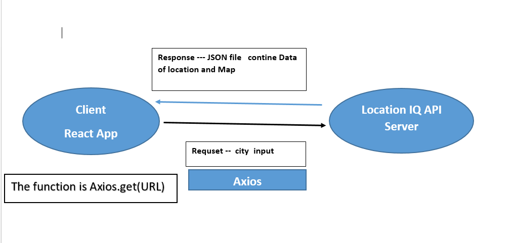

# Project Name

**Author**: Ahmed Bani-Salameh
**Version**: 1.0.1 

## Overview

city explorer is an application that takes in an input which is the city and extracts for you the details of this city like some information and the longtitude, latitude and a map where it is .
this application is essentially to give information about a city.

## Getting Started

1. clone the repository on his local machine 
2. run this command (npm i )
3. run npm start

## Architecture
<!-- Provide a detailed description of the application design. What technologies (languages, libraries, etc) you're using, and any other relevant design information. -->
languages : JavaScript , CSS  
libraries : React.js , bootstrap , axios

## Change Log

05-09-2021 6:37 pm - Application now has a fully-functional express server, with a GET route for the location resource.

## Credit and Collaborations

my colleague : Shahed Al-khateeb  
[react-bootstrap](https://react-bootstrap.netlify.app/getting-started/introduction)  
[location-IQ](https://locationiq.com)  
[axios](https://www.npmjs.com/package/axios)  
[w3schools](https://www.w3schools.com/default.asp)

## process

  

## Features

Name of feature: extracting city details

Estimate of time needed to complete: 3 hours

Start time: 1:20 pm

Finish time: 6:37 pm

Actual time needed to complete: 5 hours  